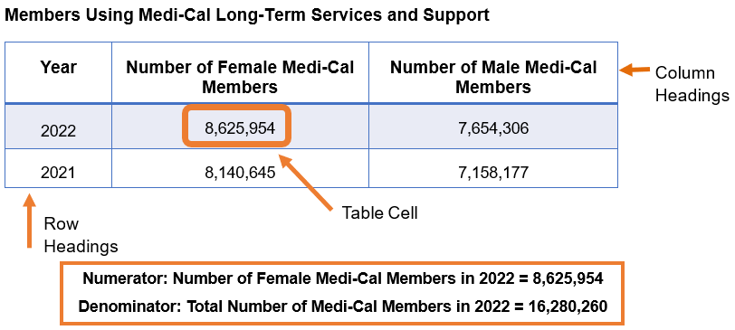
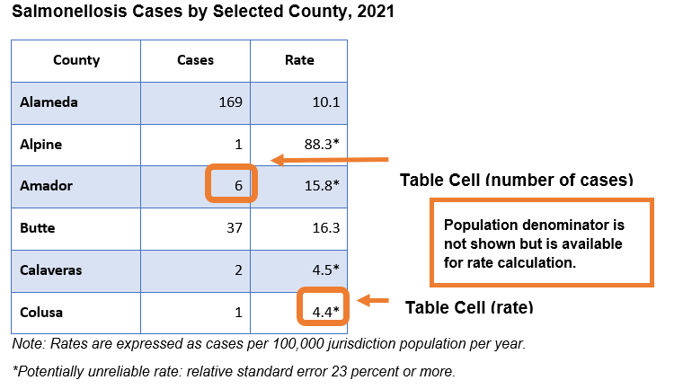
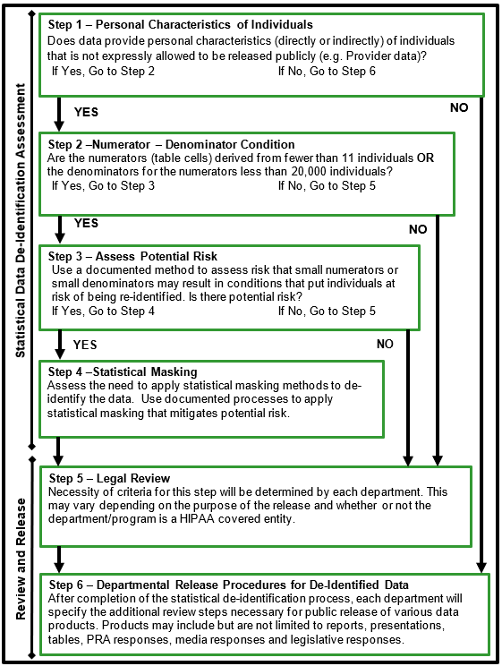

# 4. Statistical De-Identification

The DDG describes the Data Assessment for Public Release Procedure shown in Figure 5, to be used by departments in the CalHHS to assess data for public release. This Section 4 describes specific actions that may be taken for each step in the procedure with additional supporting information provided in Sections 5, 6 and 16. These steps are intended to assist departments in assuring that data is de-identified for purposes of public release that meet the requirements of the California IPA to prevent the disclosure of personal information.

The Data Assessment for Public Release Procedure includes the following steps:

1. Review the data to determine if it includes personal characteristics, directly or indirectly, that can be tied back to an individual;
2. If there is concern for personal characteristics, then assess the data for small numerators or denominators;
3. If there is concern for small numerators or denominators, assess potential risk of data release;
4. If there is potential risk identified, assess the need to apply statistical masking methods to de-identify the data;
5. Following statistical de-identification, the data release is reviewed by legal if indicated in departmental procedures; and,
6. After statistical de-identification, the data is reviewed and approved for release based on program and policy criteria pursuant to departmental procedures.

The steps above are represented in a step-wise process shown in Figure 5. Each step is described in further detail in Section 4.1 through 4.6.

Data summaries that originate from data which includes personal identifiers must be de-identified before release to the public. Additionally, data summaries about conditions experienced by individuals must be adequately de-identified to prevent re-identification of individuals represented by the summarized data. Various statistical methods are available to de-identify data statistically.&#x20;

Summarized data may be reviewed in the context of the numerator and the denominator for the given presentation. The numerator represents the number of events being reported while the denominator represents the population from which the numerator is taken. For example, if it is reported that there are 50 cases of diabetes in California then the numerator would be the number of cases (50) and the denominator would be the number of people in California that could have diabetes (more than 38 million people since diabetes can occur at any age or sex). While the numerator is relatively straight-forward to identify, the denominator can be difficult. Data summaries are frequently presented in tables in which numerators and denominators may be identified.&#x20;

The numerator is typically the value in each table cell. However, the denominator can be difficult to identify given the various ways in which tables are prepared. Two examples of tables, Figure 3 and Figure 4, show the numerators and denominators in sample tables. &#x20;

<figure><figcaption>
Figure 3. Illustration of Numerators and Denominators in a Table
</figcaption></figure>

Figure 3 shows an example table with the numerator highlighted. The Cells in the table are the boxes with values in them, as opposed to the row and column headings. The row headings are 2021 and 2022. The column headings are Year, Number of Female Medi-Cal Members, and Number of Male Medi-Cal Members. In Figure 3, “8,625,954” is the value in a table cell and represents a numerator. The sum of the row for year 2022 (8,625,954 + 7,654,306 = 16,280,260) represents a denominator. In this context, the denominator may represent row totals, column totals or the total occurrences in the dataset released. Data in Figure 3 comes from the “[Medi-Cal Long-Term Services and Supports Data” dashboard on the CalHHS Open Data Portal](#user-content-fn-1)[^1].

Figure 4 shows another type of table that contains rates. In this case, the numerator is the [number of Salmonellosis cases for a sample of California Local Health Jurisdictions in 2021](#user-content-fn-2)[^2]. The table also includes the rate of Salmonellosis for these jurisdictions. In order to calculate the rate, the population size of each jurisdiction is required, but is not shown directly in this table. The population denominator is an important element for data de-identification.

<figure><figcaption>
Figure 4: Illustration of Numerators and Denominators in a Table of Rates
</figcaption></figure>

***

<figure><figcaption>
Figure 5: Data Assessment for Public Release Procedure
</figcaption></figure>

***

### 4.1 Personal Characteristics of Individuals

As described in Section 3 and Figure 2, personal characteristics of individuals introduce the most significant risk with respect to identifying individuals in a dataset. The following are examples of personal characteristics.

* Identifiers as defined in the California IPA
* Identifiers as defined in HIPAA
* Demographics typically reported in census and other reporting
  * Race
  * Ethnicity
  * Language Spoken
  * Sex
  * Sexual Orientation and Gender Identity
  * Age
  * Socio-economic status as percent of poverty

Personal characteristics are those characteristics that are distinctive to a person and may be used to describe that person. Personal characteristics include a broader set of information than those data elements that may be specifically defined as identifiers (such as, driver license, address, birth date, etc.) Personal characteristics may also be inferred from characteristics related to provider or utilization data. For example, if presented with information about a provider that only sees women, it can be inferred that the clients are women even if that is not specifically stated in the data presentation.

### 4.2 Numerator – Denominator Condition 

The Numerator – Denominator Condition represents a combination of both the Numerator Condition and Denominator Condition and for which both conditions must be met or else a more detailed assessment is required. This may be considered as an initial screening of a dataset.

Numerator – number of events with the characteristics of the given row and column

Denominator – the population from which the events arise

The Numerator Condition sets a lower limit for the cell size of cells displayed in a table.  The DDG has set this limit as any value representing aggregated or summarized records which are derived from less than 11 individuals (clients). Of note, values of zero (0) are typically shown since a non-event cannot be identified.&#x20;

The Denominator Condition sets a minimum value for the denominator. The DDG has identified the lower limit for the denominator to be a minimum value of 20,000.

Since this is a Numerator – Denominator Condition, both the minimum cell size for the numerator and denominator must be met. If these conditions are met, the table can move to Step 5 for consideration for release to the public. If either the numerator or denominator condition is not met, then the review of the data must proceed to Step 3. &#x20;

### 4.3 Assess Potential Risk 

This step requires the use of a documented method to assess the risk that small numerators or small denominators may result in conditions that put individuals at risk of being re-identified.

Assessment of potential risk for a given dataset must take into account a range of contributing considerations. This includes understanding particular characteristics of a given dataset that is being released. For example, if the potential values for a specific personal characteristic, such as race, results in many small numbers in dataset A but does not in dataset B, then the risk may be low for dataset B and high for data A if the groupings of the personal characteristics include the same categories. For this reason, each department or program may set different values for risk based on the underlying distribution of these variables in the datasets of interest.

There are many methods\[1] used to assess potential risk. Many of the methods that are in use throughout the country are described in the various references provided in Section 11. While each department will document the method(s) chosen for use, all the CalHHS departments are directed to use the following description of the Publication Scoring Criteria as an example and as a method to assess potential risk.

#### 4.3.1 Publication Scoring Criteria: Example of tool to assess potential risk

The Publication Scoring Criteria is used to identify the presence of small values that are considered sensitive in order to facilitate the assessment of potential risk. The Publication Scoring Criteria combines a number of conditions that increase the risk of a given data table and allows the department to evaluate those risks in combination with each other. The variables included in the Publication Scoring Criteria are those variables routinely used to publish data but are not all inclusive. Explanations for the risk values assigned to variables can be found in Section 16, Appendix D. Section 16.2.14 addresses how to account for other variables that are not included in the Publication Scoring Criteria.

A variable is a symbol representing an unknown numerical or categorical value in an equation or table. A given variable may have different ranges assigned to it. Ranges assigned to the variable may be defined in many ways which may increase or decrease the risk of identification of an individual represented in the table. This is seen in the Publication Scoring Criteria in that ranges for variables which will produce smaller groupings have a higher score.

The Publication Scoring Criteria in Figure 6 quantifies with a score two identification risks: size of potential population and variable specificity. The Publication Scoring Criteria is used to assess the need to perform statistical masking as a result of a small numerator, small denominator, or both. The Publication Scoring Criteria takes into account both variables associated with numerators, such as Events, and with denominators, such as Geography or Insurance Coverage.

This method requires a score less than or equal to 12 for the data table to be released without additional masking of the data. Any score over 12 will require the use of statistical masking methods described in Section 4.4 or documentation regarding the specific characteristics of the dataset that mitigate the risk.

When identifying the score for each variable, use the highest scoring criteria. For example, if a table had age groups of 0 to 11 years, 12 to 14 years, and 15 to 18 years then the score for the “age range” variable would be +5 because the smallest age range is 12 to 14, which is an age range of three years.&#x20;

If a variable has greater granularity than the score listed, use the highest score listed. For example, if the variable “Time” has a frequency of “weekly” then the score would be +5 which is the maximum score associated with the most granular level (monthly) of the variable in the Publication Scoring Criteria.

In addition to assessing the granularity of each variable, the interaction of the variables is also important. As discussed later in Section 4.4, decreasing the granularity or the number of variables are both techniques for increasing the values for the numerators. The final criteria in Figure 6 are those for Variable Interactions. This provides for subtraction of points if the only variables presented are the events (numerator), time, and geography, and an addition of points for including more variables in a given presentation. With respect to the subtraction of points, the score is based on the minimum value for the Events variable. For example, if the smallest value for the Events is 5 or more, then the score would be -5. However, if the smallest value for the Events is 2, then the score would be 0. This is discussed in more detail in Section 16.2.

In assessing risk, scoring can be part of the justification to release or not release data but should not by itself be an absolute gateway to the release of data. The review must take into account additional considerations including those that are discussed in this document in addition to the scoring.

Figure 6: Publication Scoring Criteria Tables by Variable

Events (Numerator)

<table><thead><tr><th valign="top">Characteristics</th><th valign="top">Score</th></tr></thead><tbody><tr><td valign="top">1000+ events in a specified population</td><td valign="top">+2</td></tr><tr><td valign="top">100-999 events</td><td valign="top">+3</td></tr><tr><td valign="top">11-99 events</td><td valign="top">+5</td></tr><tr><td valign="top">&#x3C;11 events</td><td valign="top">+7</td></tr></tbody></table>

Age Range

<table><thead><tr><th valign="top"></th><th valign="top">Score</th></tr></thead><tbody><tr><td valign="top">Characteristics</td><td valign="top">Score</td></tr><tr><td valign="top">>29-year age range</td><td valign="top">+1</td></tr><tr><td valign="top">11-29 year age range</td><td valign="top">+2</td></tr><tr><td valign="top">6-10 year age range</td><td valign="top">+3</td></tr><tr><td valign="top">3-5 year age range</td><td valign="top">+5</td></tr><tr><td valign="top">1-2 year age range</td><td valign="top">+7</td></tr></tbody></table>

Race or Race/Ethnicity

The following two tables can be used for data that complies with current OMB standards (which combines race/ethnicity into one variable) and data that complies with previous 1997-2024 OMB standards (which separated race and ethnicity into two variables) as the risk assessment is the same for both.

Race or Race/Ethnicity Combined

<table data-header-hidden><thead><tr><th valign="top"></th><th valign="top">Score</th></tr></thead><tbody><tr><td valign="top">Characteristics</td><td valign="top">Score</td></tr><tr><td valign="top">White, Asian, Black or African American, Hispanic or Latino, Middle Eastern or North African</td><td valign="top">+2</td></tr><tr><td valign="top">White, Asian, Black or African American, Hispanic or Latino, Middle Eastern or North African, American Indian or Alaska Native, Native Hawaiian or Other Pacific Islander, Mixed</td><td valign="top">+3</td></tr></tbody></table>

Detailed Race or Race/Ethnicity Combined

<table data-header-hidden><thead><tr><th valign="top"></th><th valign="top">Score</th></tr></thead><tbody><tr><td valign="top">Characteristics</td><td valign="top">Score</td></tr><tr><td valign="top">
Detailed Race or Race/Ethnicity Combined with Population >4,000,000

<em>e.g., Mexican</em>
</td><td valign="top">+1</td></tr><tr><td valign="top">
 Detailed Race or Race/Ethnicity Combined with Population 300,001 – 4,000,000

<em>e</em>.<em>g., Chinese, Filipino, German, Asian Indian, Italian, Korean, Salvadoran, Guatemalan</em>
</td><td valign="top">+2</td></tr><tr><td valign="top">
Detailed Race or Race/Ethnicity Combined with Population 100,001 – 300,000

<em>e.g., Japanese, Armenian, Iranian, Aztec, Portuguese, Taiwanese, Hmong, Puerto Rican, Peruvian</em>
</td><td valign="top">+3</td></tr><tr><td valign="top">
Detailed Race or Race/Ethnicity Combined with Population 20,001 – 100,000

<em>e.g., Cambodian, Dutch, Pakistani, Egyptian, Thai, Maya, Afghan, Nigerian, Indonesian, Fijian, Native Hawaiian, Jamaican, Cuban, Colombian, Argentinean</em>
</td><td valign="top">+5</td></tr><tr><td valign="top">
Detailed Race or Race/Ethnicity Combined with Population ≤20,000

<em>e.g., Tongan, Chamorro, Bangladeshi, Sri Lankan, Brazilian, Mixtec, Kenyan, Zapotec, Malaysian, Belizean, Chumash, Sudanese, Pomo, Inca, Pipil</em>
</td><td valign="top">+7</td></tr></tbody></table>

Ethnicity

Use the following two tables to assess risk for the ethnicity variable, which will be present in data that follows pre-2024 OMB standards.

Ethnicity Only

<table><thead><tr><th valign="top"></th><th valign="top">Score</th></tr></thead><tbody><tr><td valign="top">Characteristics</td><td valign="top">Score</td></tr><tr><td valign="top">Hispanic or Latino - yes or no</td><td valign="top">+1</td></tr></tbody></table>

Detailed Ethnicity

<table data-header-hidden><thead><tr><th valign="top"></th><th valign="top"></th></tr></thead><tbody><tr><td valign="top">Characteristics</td><td valign="top">Score</td></tr><tr><td valign="top">
Detailed Ethnicity with Population >4,000,000

<em>e.g., Mexican</em>
</td><td valign="top">+1</td></tr><tr><td valign="top">
Detailed Ethnicity with Population 300,001 – 4,000,000

<em>e.g., Salvadoran, Guatemalan, Central American, South American</em>
</td><td valign="top">+2</td></tr><tr><td valign="top">
Detailed Ethnicity with Population 100,001 – 300,000

<em>e.g., Puerto Rican, Spaniard, Peruvian, Nicaraguan, Honduran</em>
</td><td valign="top">+3</td></tr><tr><td valign="top">
Detailed Ethnicity with Population 20,001 – 100,000

<em>e.g., Cuban, Colombian, Argentinean, Dominican, Panamanian</em>
</td><td valign="top">+5</td></tr><tr><td valign="top">
Detailed Ethnicity with Population ≤20,000

<em>e.g., Bolivian, Uruguayan, Paraguayan</em>
</td><td valign="top">+7</td></tr></tbody></table>

Language Spoken

<table data-header-hidden><thead><tr><th valign="top"></th><th valign="top"></th></tr></thead><tbody><tr><td valign="top">Characteristics</td><td valign="top">Score</td></tr><tr><td valign="top">English, Spanish, Other Language</td><td valign="top">+1</td></tr><tr><td valign="top">
Detailed Language with Population 300,001 – 4,000,000

<em>e.g., Chinese, Tagalog, Vietnamese, Korean</em>
</td><td valign="top">+2</td></tr><tr><td valign="top">
Detailed Language with Population 100,001 - 300,000

<em>e.g., Persian, Hindi, Arabic, Russian, Japanese, French</em>
</td><td valign="top">+3</td></tr><tr><td valign="top">
Detailed Language with Population 20,001 - 100,000

<em>e.g., German, Portuguese, Hmong, Hebrew, Bengali, Polish</em>
</td><td valign="top">+5</td></tr><tr><td valign="top">
Detailed Language with Population ≤20,000

<em>e.g., Haitian, Navajo</em>
</td><td valign="top">+7</td></tr></tbody></table>

Sex, Sexual Orientation, and Gender Identity

<table data-header-hidden><thead><tr><th valign="top"></th><th valign="top"></th><th valign="top"></th></tr></thead><tbody><tr><td valign="top">Variable</td><td valign="top">Characteristic</td><td valign="top">Score</td></tr><tr><td valign="top">Sex</td><td valign="top">Male or Female</td><td valign="top">+1</td></tr><tr><td valign="top">Sexual Orientation</td><td valign="top">Straight, Gay or Lesbian, Bisexual, Asexual</td><td valign="top">+2</td></tr><tr><td valign="top">Gender Identity</td><td valign="top">Man/Male, Woman/Female, Transgender or Non-Binary </td><td valign="top">+3</td></tr><tr><td valign="top">Gender Identity</td><td valign="top">Man/Male, Woman/Female, disaggregation of Transgender/Non-Binary category into more specific identities (e.g., Genderqueer, Two-Spirit, etc.) </td><td valign="top">+5</td></tr></tbody></table>

Intersex

<table data-header-hidden><thead><tr><th valign="top"></th><th valign="top"></th><th valign="top"></th></tr></thead><tbody><tr><td valign="top">Variable</td><td valign="top">Characteristic</td><td valign="top">Score</td></tr><tr><td valign="top">Intersex (asked as separate question)</td><td valign="top">Yes or No</td><td valign="top">+2</td></tr><tr><td valign="top">Intersex (combined with Sex question)</td><td valign="top">Male, Female, Intersex</td><td valign="top">+2</td></tr></tbody></table>

Immigration Status

<table data-header-hidden><thead><tr><th valign="top"></th><th valign="top"></th></tr></thead><tbody><tr><td valign="top">Characteristic</td><td valign="top">Score</td></tr><tr><td valign="top">U.S. Citizen, Foreign Born (combines Naturalized Citizen and Noncitizen) </td><td valign="top">+1</td></tr><tr><td valign="top">U.S. Citizen, Naturalized Citizen, Noncitizen</td><td valign="top">+1</td></tr><tr><td valign="top">Detailed Immigration Status with Disaggregation of Noncitizen Statuses - Refer to High-Risk Populations (Section 5.6.2)  </td><td valign="top">N/A</td></tr></tbody></table>

Insurance Coverage

Use the following table when reporting by insurance coverage, such as by health plan.  See Appendix I for more details on scoring scenarios involving the overlap of Insurance Coverage, Expected Payer/Public Assistance and Means-Tested Programs, and Geography. Below are three key points that summarize all the scenarios:

1\.    If the data is ONLY related to Residence or Service Geography, then DO NOT USE Insurance Coverage or Means-Tested Tables.

2\.    Means-Tested Programs—Only add interaction if enrollment in the Public Assistance program is 10 million or fewer people. No interaction is needed for Medi-Cal as the current enrollment is approximately 14 million, which exceeds 10 million.

3\.    If the number of members enrolled in Insurance Coverage is less than the population of the geographic subdivision, then use the Insurance Table. If the number of members enrolled in Insurance Coverage is greater than or equal to the population of the geographic subdivision, then use the Geography Table.

<table data-header-hidden><thead><tr><th valign="top"></th><th valign="top"></th></tr></thead><tbody><tr><td valign="top">Characteristic</td><td valign="top">Score</td></tr><tr><td valign="top">Coverage with >2,000,000 members</td><td valign="top">-5</td></tr><tr><td valign="top">Coverage with 1,000,001 - 2,000,000 members</td><td valign="top">-3</td></tr><tr><td valign="top">Coverage with 560,001 - 1,000,000 members</td><td valign="top">-1</td></tr><tr><td valign="top">Coverage with 250,001 - 560,000 members</td><td valign="top">0</td></tr><tr><td valign="top">Coverage with 100,001 - 250,000 members</td><td valign="top">+1</td></tr><tr><td valign="top">Coverage with 50,001 - 100,000 members</td><td valign="top">+3</td></tr><tr><td valign="top">Coverage with 20,001 - 50,000 members</td><td valign="top">+4</td></tr><tr><td valign="top">Coverage with ≤ 20,000 members</td><td valign="top">+5</td></tr></tbody></table>

Expected Payer/ Public Assistance and Means-Tested Programs

<table data-header-hidden><thead><tr><th valign="top"></th><th valign="top"></th></tr></thead><tbody><tr><td valign="top">Characteristic</td><td valign="top">Score</td></tr><tr><td valign="top">Enrollment > 10,000,000 people</td><td valign="top">+0</td></tr><tr><td valign="top">Enrollment 4,000,001 – 10,000,000</td><td valign="top">+1</td></tr><tr><td valign="top">Enrollment 300,001 – 4,000,000</td><td valign="top">+2</td></tr><tr><td valign="top">Enrollment 100,001 – 300,000</td><td valign="top">+3</td></tr><tr><td valign="top">Enrollment 20,001 – 100,000</td><td valign="top">+5</td></tr><tr><td valign="top">Enrollment ≤20,000</td><td valign="top">+7</td></tr></tbody></table>

Geography

If the level of reporting is best described by the geography of the individual/service, use one of the following two tables. Specifically, if the geography of the reporting is based on the residence of the individual, use the “Residence Geography” table. If the geography of the reporting is based on the location of service, use the “Service Geography” table

Residence Geography

<table><thead><tr><th valign="top"></th><th valign="top"></th></tr></thead><tbody><tr><td valign="top">Characteristic</td><td valign="top">Score</td></tr><tr><td valign="top">State or geography with population >2,000,000</td><td valign="top">-5</td></tr><tr><td valign="top">Population 1,000,001 - 2,000,000</td><td valign="top">-3</td></tr><tr><td valign="top">Population 560,001 - 1,000,000</td><td valign="top">-1</td></tr><tr><td valign="top">Population 250,001 - 560,000</td><td valign="top">0</td></tr><tr><td valign="top">Population 100,001 - 250,000</td><td valign="top">+1</td></tr><tr><td valign="top">Population 50,001 - 100,000</td><td valign="top">+3</td></tr><tr><td valign="top">Population 20,001 - 50,000</td><td valign="top">+4</td></tr><tr><td valign="top">Population 4,001 - 20,000</td><td valign="top">+5</td></tr><tr><td valign="top">Population ≤ 4,000</td><td valign="top">+7</td></tr></tbody></table>

Service Geography

<table data-header-hidden><thead><tr><th valign="top"></th><th valign="top"></th></tr></thead><tbody><tr><td valign="top">Characteristic</td><td valign="top">Score</td></tr><tr><td valign="top">State or geography with population >2,000,000</td><td valign="top">-5</td></tr><tr><td valign="top">Population 1,000,001 - 2,000,000</td><td valign="top">-4</td></tr><tr><td valign="top">Population 560,001 - 1,000,000</td><td valign="top">-3</td></tr><tr><td valign="top">Population 250,001 - 560,000</td><td valign="top">-1</td></tr><tr><td valign="top">Population of reporting region 20,001 - 250,000</td><td valign="top">0</td></tr><tr><td valign="top">Population of reporting region ≤20,000</td><td valign="top">+1</td></tr><tr><td valign="top">Address (Street and ZIP)</td><td valign="top">+3</td></tr><tr><td valign="top">Address in rural[2] area</td><td valign="top">+5</td></tr><tr><td valign="top">Address in frontier[3], [4] area</td><td valign="top">+7</td></tr></tbody></table>

Time – Reporting Period

<table data-header-hidden><thead><tr><th valign="top"></th><th valign="top"></th></tr></thead><tbody><tr><td valign="top">Characteristic</td><td valign="top">Score</td></tr><tr><td valign="top">5 years aggregated</td><td valign="top">-5</td></tr><tr><td valign="top">2-4 years aggregated</td><td valign="top">-3</td></tr><tr><td valign="top">1 year (e.g., 2001)</td><td valign="top">0</td></tr><tr><td valign="top">Bi-Annual</td><td valign="top">+3</td></tr><tr><td valign="top">Quarterly</td><td valign="top">+4</td></tr><tr><td valign="top">Monthly</td><td valign="top">+5</td></tr></tbody></table>

Variable Interactions

<table data-header-hidden><thead><tr><th valign="top"></th><th valign="top"></th></tr></thead><tbody><tr><td valign="top">Characteristics</td><td valign="top">Score</td></tr><tr><td valign="top">Only Events (minimum of 5), Time, and Population (Residence/Service Geography or Insurance Coverage)</td><td valign="top">-5</td></tr><tr><td valign="top">Only Events (minimum of 3), Time, and Population (Residence/Service Geo. or Insurance Coverage)</td><td valign="top">-3</td></tr><tr><td valign="top">Only Events (no minimum), Time, and Population (Residence/Service Geo. or Insurance Coverage)</td><td valign="top">0</td></tr><tr><td valign="top">Events, Time, and Population (Residence/Service Geo. or Insurance Coverage) + 1 variable</td><td valign="top">+1</td></tr><tr><td valign="top">Events, Time, and Population (Residence/Service Geo. or Insurance Coverage) + 2 variables</td><td valign="top">+2</td></tr><tr><td valign="top">Events, Time, and Population (Residence/Service Geo. or Insurance Coverage) + 3 variables</td><td valign="top">+4</td></tr></tbody></table>

### 1.4        Statistical Masking 

Statistical masking provides an extensive set of tools that can be used to mitigate potential risk in a given data presentation. If Step 3 of the Data Assessment for Public Release Procedure (Figure 5) determined that the dataset has a risk that small numerators or small denominators may result in conditions that put individuals at risk of being re-identified, then the dataset must be assessed to determine the need for statistical masking of those small values and complementary values. In performing the statistical masking, the data producer must consider what level of analysis may be sacrificed in order to produce a table with lower risk.

#### 1.4.1 Suppressing Small Counts

One common way of masking data is to suppress cells that contain small counts by following these steps:

1\.    Suppress cells (e.g., count of members and services provided to members) <11 (excluding 0) when total score ≥13.

2\.    After the cell suppression (<11 excluding 0) is completed, complementary cell suppression is also required so that the suppressed cells cannot be re-identified. See “Complementary Cell Suppression” section 4.4.3.

3\.    Values of 0 should not be suppressed since a non-event cannot be identified.

4\.    Suppression is also required for financial data which can be associated with members or services provided to members <11 (excluding 0).

5\.    Suppression is required for all the associated statistical entries (e.g., Prevalence rates, percentages, Mean etc.) of the suppressed cells.

6\.    An additional complementary cell needs to be suppressed if (a) OR (b) is true:

a.    all of the values suppressed in a specific group (row or column) are each ≤ 3 (1, 2, 3 excluding 0)

b.    the sum of the values suppressed is less than 11

#### 1.4.2 Other Masking Methods

Other masking methods may be applied when one of the following conditions is met:

a)    Multiple variables. This most often occurs in a pivot table presentation or a query interface where a user may have occurrences of disease X, stratified by multiple variables, such as age, sex, race, and ethnicity.

b)    Granular variables. The more granular the variable the smaller the potential numerator and denominator. This most commonly occurs with shortening the time period of reporting (weekly) or making the geography more specific (zip code or census tract). However, it can also occur when there are many categories for a variable. An example of this is aid codes in Medi-Cal where there are almost 200 aid codes.

c)    Rare events. Examples include diseases such as hemophilia. Another example is mass trauma events such as a plane crash or multi-car accident.&#x20;

In each of these cases, statistical masking may be addressed in a number of ways. For this reason, it is important to keep in mind the purpose of the reporting so that the method chosen for masking can still maximize the usefulness of the data provided. Choices for each case are highlighted below.&#x20;

a)    Multiple variables. Options include separating the table into multiple tables that limit the number of variables included in each table; decreasing the granularity of the variables included in the table; or suppression of counts <11. For example, if there are six variables of interest for study, but a table that cross-tabulates all six variables produces a large number of small cells, the data producer could consider producing several tables with fewer variables so that the risk score is <13. This is especially effective if there are very few analytic questions requiring a cross-tabulation of all six variables.

b)    Granular variables. A common approach to this situation would be to decrease the granularity of the variables (although suppressing counts <11 is also an option). This is especially useful for variables with a large number of categories that can be easily aggregated to fewer categories while still maintaining much of their utility. Geographic variables such as state or county can often be recoded into regional categories that still serve the analytic needs of the data user. It is also the only table restructuring option for tables with only two or three variables which have limited opportunities for variable reduction.

c)    Rare events: In these cases, it is challenging to suppress the value so that it cannot be used with other public information to identify individuals. Additionally, with rare events, there is more significance in the variance of small numbers. The above-mentioned suppression rules minimize the risk of re-identification most times. However, an expert should treat each data on a case-by-case basis and add additional rules if there is a risk of re-identification in any data. Please see 4.4.3 for a couple of examples in which all the above rules are covered but note that if it is revealed that the cells are suppressed due to regular suppression (<11) and not for complementary suppression then all the suppressed cells can be re-identified.

#### 1.4.3 Complementary Cell Suppression

Complementary cells are those that must be suppressed to prevent someone from calculating the suppressed cell based on row or column totals in combination with other data in that row or column. For example:

Example 1: 10-10-10

_Count of Medi-Cal Members by Age_

<table data-header-hidden><thead><tr><th valign="top"></th><th valign="top"></th><th></th></tr></thead><tbody><tr><td valign="top">Age</td><td valign="top">Count</td><td></td></tr><tr><td valign="top">A1</td><td valign="top">10</td><td></td></tr><tr><td valign="top">A2</td><td valign="top">14</td><td> </td></tr><tr><td valign="top">A3</td><td valign="top">10</td><td></td></tr><tr><td valign="top">A4</td><td valign="top">10</td><td></td></tr><tr><td valign="top">A5</td><td valign="top">0</td><td></td></tr><tr><td valign="top">A6</td><td valign="top">0</td><td></td></tr><tr><td valign="top">A7</td><td valign="top">0</td><td></td></tr><tr><td valign="top">A8</td><td valign="top">30</td><td></td></tr><tr><td valign="top">Total</td><td valign="top">74</td><td></td></tr></tbody></table>

In the above example, if we suppress the three highlighted counts for cells A1, A3 and A4 (in orange, each with values of 10) and if we reveal that it is due to regular suppression of cells <11 then anyone can guess that each cell is 10. In this case, either we should not specify that the three cells are <11 or suppress a complementary cell A2 (with a value of 14) so that the three cells highlighted in orange could not be identified.

Example 2: 10-9

_Count of Medi-Cal Members by Age_

<table><thead><tr><th valign="top"></th><th valign="top"></th></tr></thead><tbody><tr><td valign="top">Age</td><td valign="top">Count</td></tr><tr><td valign="top">A1</td><td valign="top">10</td></tr><tr><td valign="top">A2</td><td valign="top">14</td></tr><tr><td valign="top">A3</td><td valign="top">9</td></tr><tr><td valign="top">A4</td><td valign="top">17</td></tr><tr><td valign="top">A5</td><td valign="top">0</td></tr><tr><td valign="top">A6</td><td valign="top">0</td></tr><tr><td valign="top">A7</td><td valign="top">0</td></tr><tr><td valign="top">A8</td><td valign="top">30</td></tr><tr><td valign="top">Total</td><td valign="top">80</td></tr></tbody></table>

In the above example, if we suppress the two highlighted counts for A1 and A3 (in orange, with values of 10 and 9) and if we reveal that it is due to regular suppression of cells <11 then there are only 2 possible combinations (A1=10, A3=9) or (A1=9, A3=10). In this case, either we should not specify that the two cells are <11 or suppress a complementary cell (A2, with a value of 14) so that the cells highlighted in orange could not be identified.

Example 3. When to suppress 0?

_Counts and Percentages of Medi-Cal Members by County_

<table data-header-hidden><thead><tr><th valign="bottom"></th><th valign="bottom"></th><th valign="bottom"></th></tr></thead><tbody><tr><td valign="bottom">County</td><td valign="bottom">Count</td><td valign="bottom">Percent</td></tr><tr><td valign="bottom">XXX</td><td valign="bottom">3</td><td valign="bottom">0.0</td></tr><tr><td valign="bottom">YYY</td><td valign="bottom">15</td><td valign="bottom">1.0</td></tr><tr><td valign="bottom">ZZZ</td><td valign="bottom">0</td><td valign="bottom">0.0</td></tr></tbody></table>

In this example, the percentage of 0.0 should not be suppressed for County ZZZ because it is based on a non-event. However, the percentage of 0.0 for County XXX needs to be suppressed because it is due to rounding of numbers. For example, if the denominator for the County XXX percentage is 7,500, a count of 4 would have a rounded percentage of 0.1. Therefore, it could be inferred that the count for County XXX is 1, 2, or 3 because a count of 3 is the highest value that would have a rounded percentage of 0.0 and counts of 0 are not suppressed. Consequently, summary statistics based on suppressed counts should not be reported even if the rounded value is 0 due to the potential for the information to be used for inference of suppressed values.

Example 4. When does indication of complementary suppression lead to data re-identification?

_Count of Medi-Cal Members by Age_

<table data-header-hidden><thead><tr><th valign="top"></th><th valign="top"></th></tr></thead><tbody><tr><td valign="top">Age</td><td valign="top">Count</td></tr><tr><td valign="top">A1</td><td valign="top">14</td></tr><tr><td valign="top">A2</td><td valign="top">14</td></tr><tr><td valign="top">A3</td><td valign="top">1</td></tr><tr><td valign="top">A4</td><td valign="top">11</td></tr><tr><td valign="top">A5</td><td valign="top">0</td></tr><tr><td valign="top">A6</td><td valign="top">0</td></tr><tr><td valign="top">A7</td><td valign="top">0</td></tr><tr><td valign="top">A8</td><td valign="top">30</td></tr><tr><td valign="top">Total</td><td valign="top">70</td></tr></tbody></table>

In the above example, if we suppress the two highlighted counts for A3 and A4 (in orange, with values of 1 and 11) and if we reveal that A3 is due to regular suppression and A4 is due to complementary suppression then with the given total both the cells can be re-identified. In this case, we should not specify the nature of the suppressed cell so that the cells highlighted in orange could not be identified.

In these cases, it will be necessary to suppress small cells and perform complementary suppression to ensure that precise values of small cells cannot be calculated using the values of unsuppressed cells and marginal values. In the simplest case, this means ensuring that each column and row of a two-dimensional table has at least two suppressions. This ensures that the precise values of the suppressed cells cannot be calculated. Complementary suppressions are often selected using one of the methods listed below.

1\.    The ‘analytically least interesting’ level of a particular dimension. This is often ‘other’, or ‘I don’t know’.

2\.    The smallest cell available for complementary suppression. This is based on minimizing the ‘information loss’.

The cell most similar to the cell needing complementary suppression, such as adjacent age groups. This can produce complementary suppression that may be easier to interpret. It is important to clearly designate which cells have been suppressed due to complementary suppression. Use a symbol to indicate the cell has been suppressed. Identify any other cells (complementary cells) that can be used to calculate the small cell and use a symbol to indicate the cell has been suppressed. Please see below two ways to indicate cell suppression.

1\.    Suppression symbols for Machine Readable Version: The Open Data Portal requires submission of a machine-readable format. Therefore, the CalHHS Open Data Portal guidelines\[5] provides instructions on the table structure.

CalHHS Open Data Portal Small Cell Suppression Guidelines

·         Guidelines: Use an annotation field (column) in each data table that corresponds to records that have suppressed cells.

·         Small Cell Data Standard:

o   Value in cell is blank if blank due to “annotation”

o   “0” in cell if value is 0

o   Annotation field table:

<table data-header-hidden><thead><tr><th valign="top"></th><th valign="top"></th></tr></thead><tbody><tr><td valign="top">Annotation Field</td><td valign="top">Definition</td></tr><tr><td valign="top">0 or blank</td><td valign="top">No annotation or blank</td></tr><tr><td valign="top">1</td><td valign="top">Cell suppressed for small numbers</td></tr><tr><td valign="top">2</td><td valign="top">Cell suppressed for complementary cell</td></tr><tr><td valign="top">3</td><td valign="top">No data is available</td></tr><tr><td valign="top">4</td><td valign="top">Statistically unstable value</td></tr><tr><td valign="top">5</td><td valign="top">Incomplete data</td></tr></tbody></table>

o   Data Dictionary / Metadata indicates small cell method used (<11, etc.)

·         Considerations:

o   Use metadata and documentation to inform users.

o   Consider highlighting and drawing attention to annotated fields.

&#x20;

2\.    Suppression Symbols for Non-Machine-Readable Version: Departments may want to present data in a non-machine-readable format for usability of the data. In this case, use the symbols "S," "\*," or similar symbols for counts less than 11. Use symbols “C”, “\*\*”, or similar symbols for complementary cells. When suppressing values, it is recommended to use the following footnote to indicate the suppression.

Values or cells marked as “S”, “\*”, or a similar symbol in the data would have the following footnote or note:

* “S” represents Counts that are less than 11 which are not shown in accordance with the CalHHS DDG Edition 2.0.

&#x20;Values or cells marked with “C”, “\*\*”, or similar symbols indicate complementary cells would have the following footnote or note:

“C” represents counts for complementary data that are not shown in accordance with the CalHHS DDG Edition 2.0.

### 4.4.4 Masking a Three Category Variable (e.g. Intersex Status)

A special situation may occur when complementary cell suppression must be applied to a variable with three categories. This occurs when “Intersex” is an option for the Sex variable (Male, Female, Intersex), but can occur in any situation where a variable has two large categories and one small category (for example, if the options for Gender Identity included Man, Woman, and Nonbinary).

 

&#x20;

As an example:

<table data-header-hidden><thead><tr><th valign="top"></th><th valign="top"></th><th valign="top"></th><th valign="top"></th></tr></thead><tbody><tr><td valign="top">Male</td><td valign="top">Female</td><td valign="top">Intersex</td><td valign="top">Total</td></tr><tr><td valign="top">545</td><td valign="top">545</td><td valign="top">10</td><td valign="top">1100</td></tr></tbody></table>

If the DDG risk assessment concludes that counts less than 11 must be suppressed, then complementary suppression must be applied to either the Male or Female categories so that the Intersex count of 10 cannot be back-calculated. The problem is that suppression of either category would deprive the public of vital information and hence be publicly unacceptable. Other masking methods (such as combining Intersex with either the Male or Female categories; or reassigning the Intersex individuals to both categories equally) will likely also be unacceptable as they would be viewed as erasure of the Intersex identity.

In these instances, the recommendation is to not show counts at all, but only percentages rounded to the nearest whole percent. Such a “rounding error” will effectively mask the smallest category without requiring complementary suppression.

Here are the raw percentages for the above example:

<table data-header-hidden><thead><tr><th valign="top"></th><th valign="top"></th><th valign="top"></th><th valign="top"></th></tr></thead><tbody><tr><td valign="top">Male</td><td valign="top">Female</td><td valign="top">Intersex</td><td valign="top">Total</td></tr><tr><td valign="top">49.545%</td><td valign="top">49.545%</td><td valign="top">0.009%</td><td valign="top">100%</td></tr></tbody></table>

Here are the rounded percentages:

<table data-header-hidden><thead><tr><th valign="top"></th><th valign="top"></th><th valign="top"></th><th valign="top"></th></tr></thead><tbody><tr><td valign="top">Male</td><td valign="top">Female</td><td valign="top">Intersex</td><td valign="top">Total</td></tr><tr><td valign="top">50%</td><td valign="top">50%</td><td valign="top">&#x3C;1%</td><td valign="top">100%</td></tr></tbody></table>

Once the percentages are rounded, one cannot back-calculate to obtain the Intersex count, even if one knows the total is 1100. One would only know that the count is less than 11, which is the same knowledge as with standard suppression practices. It is recommended that a footnote is provided to explain why this was done, for example:

“To protect individual privacy, counts are not provided for this table and percentages have been rounded to the nearest whole number. Due to rounding, totals for all categories may not add up to 100%.”

A few other points regarding this method:

* Ensure that counts for the variable are not provided anywhere else in the document and are not available in the public domain. In the above example, one needs to make sure one cannot obtain a total count of 545 males and females elsewhere (for example, in a table that cross-tabulates sex by race).
* This method is only effective if the total number of individuals is 1100 or above. Below this threshold, one can back-calculate counts of less than 11 even when percentages are rounded.
* This method is only needed for a three-category variable. In the above example, if Intersex were presented as a separate “yes/no” variable and no cross-tabulation with Sex was provided, then complementary suppression would not be required, and this issue would not arise.

### 4.4.5 Balancing privacy and equity goals

Data de-identification, which ensures individuals are not made identifiable by public facing data, and the use of masking to preserve privacy and confidentiality, exist alongside the need to produce high-quality analyses focused on equity and disproportionality. Underrepresented or marginalized communities are more likely to have their data masked in data de-identification efforts due to smaller cell sizes, which can result in a lack of information that can be safely made publicly available about those populations. Section 4.4.2 outlines suggestions on how to preserve information while also preserving confidentiality. Intuitive ways to preserve information while also preserving confidentiality include presenting data as percentages, aggregating smaller groups into reportable-sized ones, or multi-year reporting that relates marginalized or underreported groups to an average. In addition, the DDG Peer Review Team remains committed to evaluating ways to continue to balance these goals through continued training and other innovative methodologies on an ongoing basis, including those listed in Appendix E.

## 4.5 Expert Determination Documentation and Legal Review 

This section varies by department. See the individual department DDGs for more information about departments’ legal and other reviews, including who does it and the purpose of the review.

## 4.6 Departmental Release Procedure for De-identified Data 

This section varies by department. See the individual department DDGs for more information about the additional review steps departments determine to be necessary for public release of various data products after completion of the statistical de-identification process.

 

***

\[1] Garfinkel, et al., “De-Identifying Government Datasets: Techniques and Governance”, National Institute of Standards and Technology Special Publication 800-188, [https://doi.org/10.6028/NIST.SP.800-188](https://doi.org/10.6028/NIST.SP.800-188)

\[2] U.S. Census Bureau, 2020 Census ”Urban and Rural” Classifications, [https://www.census.gov/programs-surveys/geography/guidance/geo-areas/urban-rural.html](https://www.census.gov/programs-surveys/geography/guidance/geo-areas/urban-rural.html)

\[3] National Rural Health Association, ”Definition of  Frontier” Policy Paper, February 2016, Retrieved June 2025 from:  [https://www.ruralhealth.us/getmedia/132306e1-1643-4b40-818a-4d743317dc7e/NRHAFrontierDefPolicyPaperFeb2016.pdf](https://www.ruralhealth.us/getmedia/132306e1-1643-4b40-818a-4d743317dc7e/NRHAFrontierDefPolicyPaperFeb2016.pdf)

\[4] U.S. Department of Agriculture Economic Research Service, ”Frontier and Remote Area Codes”, Retrieved June 2, 2025, from [https://www.ers.usda.gov/data-products/frontier-and-remote-area-codes](https://www.ers.usda.gov/data-products/frontier-and-remote-area-codes)

\[5] CalHHS Open Data Handbook “Publication Guidelines for CalHHS Departments and Offices”, [https://kb.data.chhs.ca.gov/odp/guidelines](https://kb.data.chhs.ca.gov/odp/guidelines) 

***

\[1] Data was extracted from the _Medi-Cal Long-Term Services and Supports Data_ files for 2021 and 2022, CalHHS Open Data Portal: [https://data.chhs.ca.gov/dataset/long-term-services-and-supports](https://data.chhs.ca.gov/dataset/long-term-services-and-supports)

&#x20;

[^1]: Data was extracted from the _Medi-Cal Long-Term Services and Supports Data_ files for 2021 and 2022, CalHHS Open Data Portal: [https://data.chhs.ca.gov/dataset/long-term-services-and-supports](https://data.chhs.ca.gov/dataset/long-term-services-and-supports)

[^2]: Data was sourced for the first six counties listed alphabetically within the “Salmonellosis, Cases and Rates by Health Jurisdiction” table in _CDPH Infectious Diseases Branch (IDB) Yearly Summaries of Selected Communicable Diseases in California, 2013-2021_, [https://www.cdph.ca.gov/Programs/CID/DCDC/CDPH%20Document%20Library/YearlySummariesofSelectedCommDiseasesinCA2013-2021.pdf](https://www.cdph.ca.gov/Programs/CID/DCDC/CDPH%20Document%20Library/YearlySummariesofSelectedCommDiseasesinCA2013-2021.pdf)
