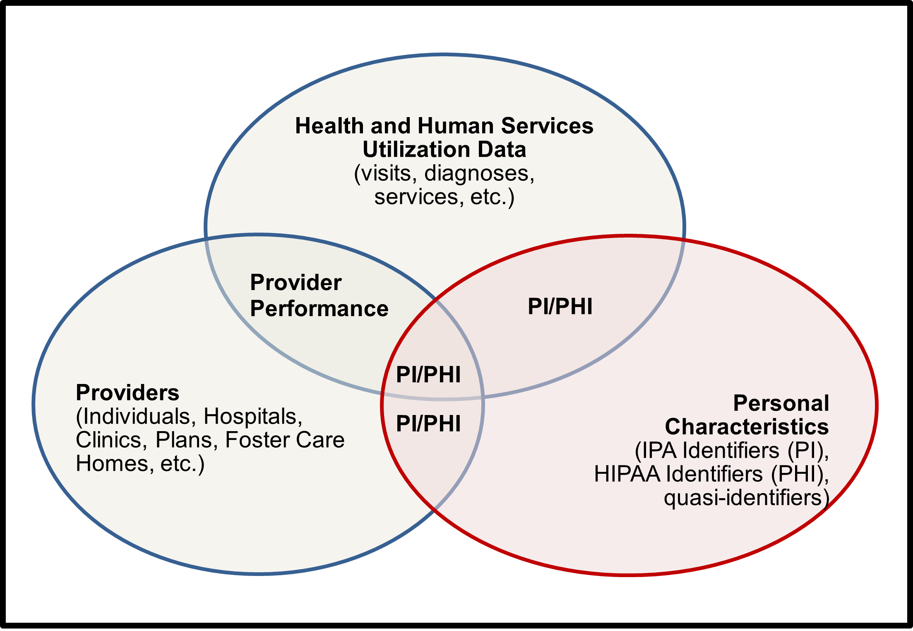

# 3. Scope

Data de-identification practices will be implemented by each department and office (further referred to as department) in the agency. This DDG is the default policy for CHHS departments. If a CHHS department wants to create a department DDG, it must have appropriate references to departmental processes and the department must file a copy of their DDG with the Office of the Agency Information Officer (OAIO). For example, the Legal Review process and the Departmental Release Procedures for De- Identified Data require additional information to describe these steps within each department. Additionally, a department with programs not covered by HIPAA will not require specific HIPAA references. A department must request DDG consultation from the CHHS peer review team (PRT), described in Section 8: DDG Governance prior to implementation. The PRT is available to review the department’s documentation to ensure it is consistent with the principles of the CHHS DDG and meets requirements of the California IPA.

The CHHS DDG is focused on the assessment of aggregate or summary data for purposes of de-identification and public release. Aggregate data means collective data that relates to a group or category of services or individuals. The aggregate data may be shown in table form as counts, percentages, rates, averages, or other statistical groupings.

Departments are sometimes asked to release record level data. Record level data refers to information that is specific to a person or entity. For example, a record for Jane Doe may include demographics and case information specific to Jane Doe.

However, summary data would include information from Jane Doe combined, or summarized, with data from other individuals. If record level data is to be publicly released, it must be assessed to ensure it is de-identified and does not include Personal Information (PI)5 or Protected Health Information (PHI).6 Although the DDG is focused on summarized data, it can be used to assist with review of individual or record level data. The record level data should be assessed both for uniqueness of the records and for the possibility that the data can be used in conjunction with other information available to the requester to identify individuals in the data. Record level data inherently has higher risk than summarized data, even after personal identifiers are removed.

Therefore, record level data for public release should be assessed on a case by case basis.

CHHS collects, manages and disseminates a wide range of data. The focus for the DDG is on data that includes personal characteristics of individuals who have a legal right to privacy. Personal characteristics include but are not limited to age, race, sex, and residence and other identifiers specified in the IPA and HIPAA and listed in the tables below. These guidelines will focus on the assessment of personal characteristics that are included in various data sets or tables to assess risk for identification of the individuals to which they pertain.

## Unique Identifiers



Any information that identifies or describes an individual, including but not limited to:\[1]

* Name
* Social security number
* Physical description
* Home address
* Home telephone number
* Education
* Financial matters
* Medical history
* Employment history

Electronically collected personal information:\[2]

* His or Her name
* Social Security Number
* Physical description
* Home address
* Home telephone number
* Education
* Financial matters
* Medical or employment history
* Password
* Electronic mail address
* Information that reveals any network location or identity

Excludes information relating to individuals who are users serving in a business capacity, including, but not limited to, business owners, officers, or principals of that business.



* Names
* All geographic subdivisions smaller than a state, including street address, city, county, precinct, ZIP code, and their equivalent geocodes, except for the initial three digits of the ZIP code if, according to the current publicly available data from the Bureau of the Census:
  * The geographic unit formed by combining all ZIP codes with the same three initial digits contains more than 20,000 people; and
  * The initial three digits of a ZIP code for all such geographic units containing 20,000 or fewer people is changed to 000
* All elements of dates (except year) for dates that are directly related to an individual, including birth date, admission date, discharge date, death date, and all ages over 89 and all elements of dates (including year) indicative of such age, except that such ages and elements may be aggregated into a single category of age 90 or older
* Telephone numbers
* Fax numbers
* Email addresses
* Social security numbers
* Medical record numbers
* Health plan beneficiary numbers
* Account numbers
* Certificate/license numbers
* Vehicle identifiers and serial numbers, including license plate numbers
* Device identifiers and serial numbers
* Web Universal Resource Locators (URLs)
* Internet Protocol (IP) addresses
* Biometric identifiers, including finger and voice prints
* Full-face photographs and any comparable images
* Any other unique identifying number, characteristic, or code



Assessing the risk of an unauthorized disclosure that violates an individual’s right to privacy and/or confidentiality, as provided by statute, may be achieved by associating personal characteristics with a person’s identity or attributes. When these characteristics can successfully confirm an individual’s identity in a publicly released data set, then release of this data results in disclosure of personal information.

Less obvious qualities in data sets and elements that may be used to identify individuals or groups can present uniqueness in data. Individual uniqueness in the released data and in the population is a quality that helps distinguish one person from another and is directly related to re-identification of individuals in aggregate data. Disclosure risk becomes a concern when released data reveal characteristics that are unique in both the released data and in the underlying population. The risk of re-identifying an individual or group of individuals increases when unique or rare characteristics are “highly visible”, or are readily accessible by the general public without any special or privileged knowledge. Unique or rare personal characteristics (e.g., height above 7 feet) or information that isolate individuals to small demographic subgroups (e.g., American Indian Tribal membership) increase the likelihood that someone can correctly attribute information in the released data to an individual or group of individuals.9

### Assessment of variables and their uniqueness

There are a number of variables that are unique to individuals that have been identified in various laws and are considered identifiers (PI/PHI). There are two primary laws that describe identifiers, shown in Figure 1, in California: the IPA and the federal HIPAA. Other variables that are commonly used to publish information to the public have been called quasi-identifiers because while they are not unique by themselves, they can become unique in the right combination. The variables shown in the Publication Scoring Criteria in Figure 6 can be considered quasi-identifiers and will be discussed further in Sections 4 and 6.

### Assessment of risk in the context of maximizing the usefulness of the information presented

The removal of PI and PHI from datasets is often considered straight-forward, because as soon as data is aggregated or summarized the majority of the data fields defined as identifiers in the IPA and HIPAA are removed. However, various characteristics of individuals may remain that alone or in combination could contribute to identifying individuals. These characteristics have been described as quasi-identifiers. Figure 2 helps demonstrate the quasi-identifier concept. For instance, there is interest in reporting about providers, where providers may be individuals, clinics, group homes, or other entities. Each of these providers has a publicly available address and has publicly available characteristics. While patients may come to a provider from anywhere, they typically will visit providers within a certain distance of their residence. Thus, by publicly publishing details on providers, data miners with malicious intent would have a targeted geography that lists locality information, types of services offered and received, and demographic information about patients. To expand on this example, data that states a provider saw two patients with heart disease does not indicate who had the heart disease nor does it reveal the identity of the two patients amongst the thousands of patients that provider sees. However, datasets that display a provider within a given region with two Black or African American female patients under age 10 with heart disease may release enough personal characteristics about the patients to successfully reveal their identity. These compounding patient details released about providers that give geography information (address), health condition (heart disease), and person- based characteristics (quasi-identifiers) of the patients puts the dataset in the overlapping area of the diagram of Figure 2. This overlap, consequently, highlights potential risks associated with seemingly innocent summary data.

<figure><figcaption></figcaption></figure>
